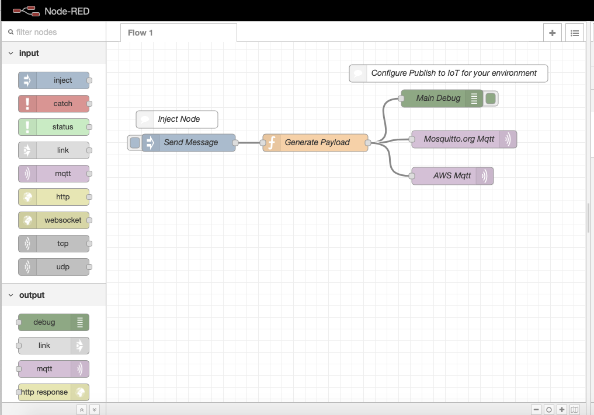

# AWS EKS Infrastructure & Node RED deployment using Pulumi

[](https://app.pulumi.com/new)

## Table of Contents
- [AWS EKS Infrastructure & Node RED deployment using Pulumi](#AWS-EKS-Infrastructure--Node-RED-deployment-using-Pulumi)
  - [Table of Contents](#Table-of-Contents)
  - [Overview](#Overview)
  - [Getting Started](#Getting-Started)
    - [Install Pulumi CLI](#Install-Pulumi-CLI)
    - [Prerequisites](#Prerequisites)
  - [Create a new EKS cluster](#Create-a-new-EKS-cluster)
  - [Setting up NGINX Ingress Controller](#Setting-up-NGINX-Ingress-Controller)
  - [Deploy Node-RED in Cluster](#Deploy-Node-RED-in-Cluster)
  - [Thoughts & Conclusion](#Thoughts--Conclusion)

## Overview

I'm going to share my initial thoughts and impressions of [Pulumi](https://pulumi.io) on coding infrastructure using Typescript. I have been coding AWS EKS infrastructure recently using Terraform. I really like Terraform how it helps on the building, changing and versioning infrastructure and its portability. It's a great tool with no doubt, but I'm exploring other options including [AWS CDK](https://github.com/awslabs/aws-cdk) which are more convenient to code in my favorite language (Javascript/Typescript) instead of YAML or DSLs (Domain Specific Language) and multi-cloud infrastructure coding.

I come across [Pulumi](https://pulumi.io) - a tool to code infrastructure using Typescript. Pulumi's SDK is fully open source and extensible, enabling you to participate in a rich ecosystem of libraries that ease common tasks, ranging from containers to serverless to infrastructure, and everything in between. 

In this repo, let's walk through how to get started with Pulumi and create the AWS EKS infrastructure and deploy Node-Red - Flow-based programming for the Internet of Things (IoT) in Kubernetes cluster.

## Getting Started

### Install Pulumi CLI

To get started, you've to install the [Pulumi](https://pulumi.io) CLI tool. If you are using macOS, you can use homebrew to install it.

```bash
$ brew install pulumi
```

If you want to install it in Linux​ run the below script to install.

```bash
$ curl -fsSL https://get.pulumi.com | sh
```

or run the below script in Cmd to install it in Windows.

```bash
@"%SystemRoot%\System32\WindowsPowerShell\v1.0\powershell.exe" -NoProfile -InputFormat None -ExecutionPolicy Bypass -Command "[Net.ServicePointManager]::SecurityProtocol = [Net.SecurityProtocolType]::Tls12; iex ((New-Object System.Net.WebClient).DownloadString('https://get.pulumi.com/install.ps1'))" && SET "PATH=%PATH%;%USERPROFILE%\.pulumi\bin"
```

Once installed, print the version of pulumi to verify everything is in working order by running the pulumi CLI:

```bash
$ pulumi version
```

### Prerequisites

Install other prerequisites to create AWS EKS and develop the infrastructure using Typescript.

*  Install [NodeJS](https://nodejs.org/en/download/) (10.x or later)
*  Install [npm]((https://nodejs.org/en/download/)) - NodeJS Package Manager
*  Install & Configure [AWS CLI](https://aws.amazon.com/cli/)
*  Install [AWS IAM Authenticiator](https://github.com/kubernetes-sigs/aws-iam-authenticator) for Kubernetes

## Create a new EKS cluster

* Create an empty project with `pulumi new` and choose a template `aws-typescript` to create a minimal AWS Typescript Pulumi program.
```bash
$ pulumi new
```

* Install required package.json dependencies.
```bash
$ npm install --save @pulumi/eks @pulumi/kubernetes
```

* Add the below code in `index.ts`
```typescript
import * as pulumi from "@pulumi/pulumi";
import * as eks from "@pulumi/eks";
import * as awsx from "@pulumi/awsx";
import * as k8s from "@pulumi/kubernetes";

const name = "smart-iot";

const vpc = new awsx.ec2.Vpc("vpc", { subnets: [{ type: "public" }] });
const cluster = new eks.Cluster(name, {
    vpcId: vpc.id,
    subnetIds: vpc.publicSubnetIds,
    desiredCapacity: 2,
    minSize: 1,
    maxSize: 2,
    storageClasses: "gp2",
    deployDashboard: false,
});

// Export the clusters' kubeconfig.
export const kubeconfig = cluster.kubeconfig
```

* To preview and deploy changes, run `pulumi up` and select “yes.” The up sub-command shows a preview of the resources that will be created and prompts on whether to proceed with the deployment.
   
* To access your EKS cluster using kubectl, we need to set up the kubeconfig file and download kubectl
```bash
$ pulumi stack output kubeconfig > kubeconfig
$ export KUBECONFIG=`pwd`/kubeconfig

$ kubectl version
$ kubectl cluster-info
$ kubectl get nodes
```

Now, our EKS cluster is ready. Now let's deploy nginx-ingress controller to setup and ingress.

## Setting up NGINX Ingress Controller

Install `nginx-ingress` helm chart to bootstrap an nginx-ingress deployment on a Kubernetes cluster using the Helm package manager. Just add helm chart resource options using the Pulumi Kubernetes provider pointing at the newly provisioned EKS cluster.

```ts
const resourceOptions: ComponentResourceOptions = {
    providers: { kubernetes: cluster.provider }
};

const nginxIngressChartOpts = {
    repo: 'stable',
    chart: 'nginx-ingress'
};

const nginxIngress = new k8s.helm.v2.Chart('nginx-ingress', nginxIngressChartOpts, resourceOptions);
```

Get the ingress URL and export it to pulumi output.

```ts
export const appUrl = nginxIngress.getResourceProperty('v1/Service', 'nginx-ingress-controller', 'status')
    .apply(status => status.loadBalancer.ingress[0].hostname);
```

## Deploy Node-RED in Cluster

Node-RED is a programming tool for wiring together hardware devices, APIs, and online services in new and exciting ways. It provides a browser-based editor that makes it easy to wire together flows using the full range of nodes in the palette that can be deployed to its runtime in a single click.

Node-RED helm chart ( not maintained by node-red )  is available at helm charts stable repository.

```ts
const chartOpts = {
    repo: 'stable',
    chart: 'node-red',
    values: {
        config: {
            timezone: 'America/New_York'
        },
        ingress: {
            enabled: true,
            hosts: ['*.elb.amazonaws.com']
        }
    }
};

const nodeRed = new k8s.helm.v2.Chart('node-red', chartOpts, resourceOptions);
```

To preview and deploy the updated changes, run `pulumi up` and select “yes.” The up sub-command shows a preview of the resources that is created.

Get the app URL of the node-red using by running pulumi stack output command.

```bash
$ pulumi stack output appUrl
```

You can navigate to the app URL to see the Node-RED application running in kubernetes cluster.



## Thoughts & Conclusion

And, that's the overall code for creating EKS Cluster, setting up ingress controller and Node-RED application in EKS cluster. The primary lift of EKS cluster is magically done on @pulumi/eks and `@pulumi/awsx` Pulumi Crosswalk for AWS. As in terraform, Pulumi also supports local and remote backends to store your [state](https://pulumi.io/reference/state/). Finally, you are going to code the infrastrucutre in your favorite language is awesome.

You should give it a try Pulumi, build your infrastructure using Typescript/Javascript. 